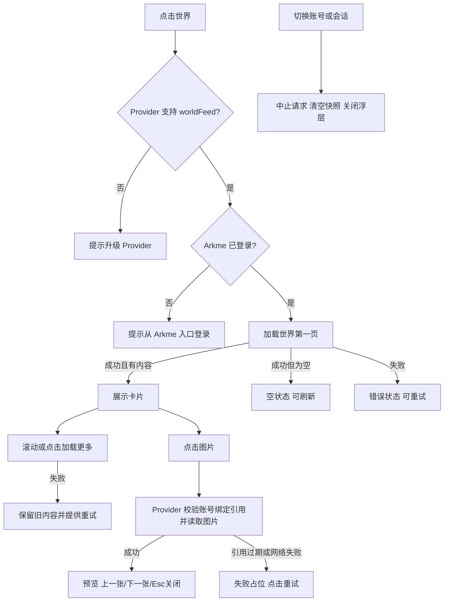

# Arkme World for DeepSeek Harness

Arkme World 是一个 DeepSeek Harness 桌面端的 Arkme 插件的子插件。它把 Arkme 移动端“世界”的公开内容投影到 DSH，复用 `@senguoyun/dsh-arkme` Provider 的登录态、头像解析与受控图片读取能力，不自行保存账号凭据。

## 能力

- 从 DSH 左侧底部“世界”入口打开独立浮层，不替换原生 Conversation。
- 展示作者、头像、正文、发布时间、公开图片和媒体数量。
- 支持刷新、增量分页、图片失败重试和键盘可操作的图片预览。
- 明确区分加载、未登录、不支持、空数据、失败和成功状态。
- 切换账号或 DSH 会话时清空旧快照和短期图片引用。

当前版本为只读呈现，不提供发布、评论、举报或分享入口。

## 依赖

必须同时安装 Arkme Provider：

```sh
DSH_HOME=<dsh-home> dsh plugin --profile web add @senguoyun/dsh-arkme
DSH_HOME=<dsh-home> dsh plugin --profile web add @senguoyun/dsh-arkme-world
DSH_HOME=<dsh-home> dsh web --port 3080
```

Provider 必须声明 `capabilities().features.worldFeed === true`。旧版 Provider 仍允许本插件启动，但页面只会提示升级，不会尝试读取内部文件、Token 或私有接口。

安装本地不可变包：

```sh
pnpm pack --pack-destination <artifact-directory>
DSH_HOME=<dsh-home> dsh plugin --profile web add <artifact-directory>/senguoyun-dsh-arkme-world-0.1.0.tgz
```

## UI 结构图

```text
DSH Sidebar                      Native Conversation
┌─────────────────────┐          ┌─────────────────────────────────┐
│ Arkme               │          │ ┌ Arkme World ─ 刷新 ─ 关闭 ┐ │
│ …                   │          │ │ 作者头像  作者名   时间     │ │
│ 世界                │ ───────▶ │ │ 标题 / 正文                 │ │
└─────────────────────┘          │ │ 图片网格 → 图片预览         │ │
                                 │ │ 加载更多 / 已经看到这里     │ │
                                 │ └─────────────────────────────┘ │
                                 └─────────────────────────────────┘
```

## 交互与失败恢复图



## 安全边界

- Browser 只接收账号绑定的不透明 `recordRef`、`avatarRef` 和 `imageRefs`。
- Provider 不向 Browser 暴露稳定记录 ID、`file_asset://`、签名 OSS URL、Bearer Token 或 STS 凭据。
- 图片引用短期有效；过期后通过刷新世界列表获取新引用。
- 图片按实际字节签名识别 PNG、JPEG、WebP 或 GIF，并受 Provider 大小与可信域名限制。

## 本地开发

```sh
pnpm install --frozen-lockfile
pnpm run typecheck
pnpm test
pnpm run build
pnpm pack
```

源码使用 DSH 官方 `sidebar.footer.action` 扩展位。卸载本插件不会移除 Arkme Provider 的登录态、缓存或其他业务数据。
